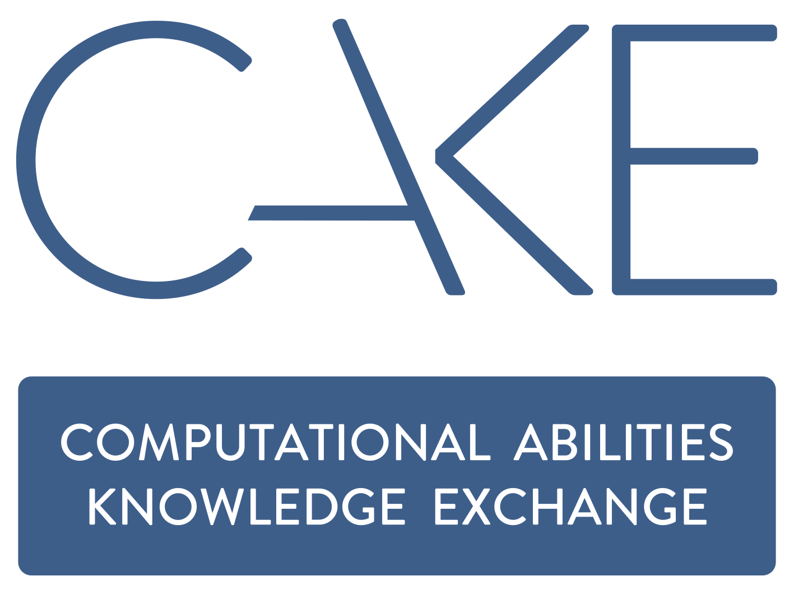
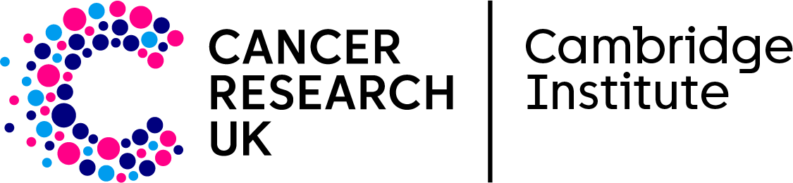
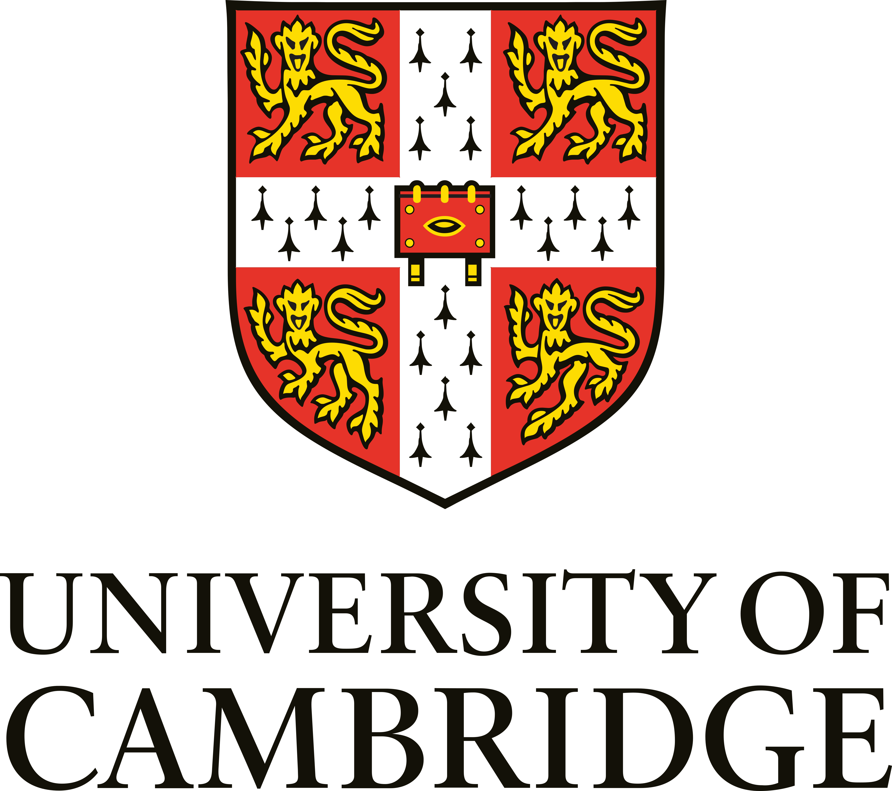

::: {.hero-shell}
::: {.home-hero}
::: {.home-hero__text}
CAKE fellowship project

# Safer, more transparent generative AI use in biomedical research {.hero-title}

::: {.hero-copy}
Welcome to my CAKE fellowship page on responsible generative AI in biomedical research. I’m using this site to share the project as it develops: notes, updates, resources, reading, and practical tools for safer and more thoughtful AI use in research. My aim is to build something useful, transparent, and reusable for both my own work and for others working in similar settings.
:::

::: {.hero-actions}
[Browse resources](resources/index.qmd){.pill-link}
[Suggest content on GitHub](contribute.qmd){.pill-link .is-light}
:::

::: {.logo-strip aria-label="Project partners and host institutions"}
Affiliations
{fig-alt="Computational Abilities Knowledge Exchange logo" .logo-strip__logo .logo-strip__logo--cake}
{fig-alt="Cancer Research UK Cambridge Institute logo" .logo-strip__logo .logo-strip__logo--cruk}
{fig-alt="University of Cambridge logo" .logo-strip__logo .logo-strip__logo--cambridge}
:::
:::

::: {.home-hero__icon}
{fig-alt="Microscope icon"}
:::
:::

:::

## What this site is for

::: {.site-purpose}
- Share updates and practical outputs from the CAKE fellowship.
- Gather guidance, training material and useful background materials in one place.
- Keep draft work visible so the project can be discussed and improved as it develops.
:::

## Resources

::: {.home-link-grid}
::: {.home-link-card}
{fig-alt="Guidance icon" .home-link-card__icon}

### Guidance

Practical guidance pages intended to consolidate principles, boundaries and standard approaches for responsible generative AI use.

[Open guidance](guidance/index.qmd)
:::

::: {.home-link-card}
{fig-alt="Training icon" .home-link-card__icon}

### Training

Workshop material, case studies and notes from clinics or pilot sessions that can later be reused by other groups.

[Open training](training/index.qmd)
:::

::: {.home-link-card}
{fig-alt="Materials icon" .home-link-card__icon}

### Materials

Reading notes, Cambridge links and other useful material gathered during the fellowship.

[Open materials](resources/materials.qmd)
:::
:::
